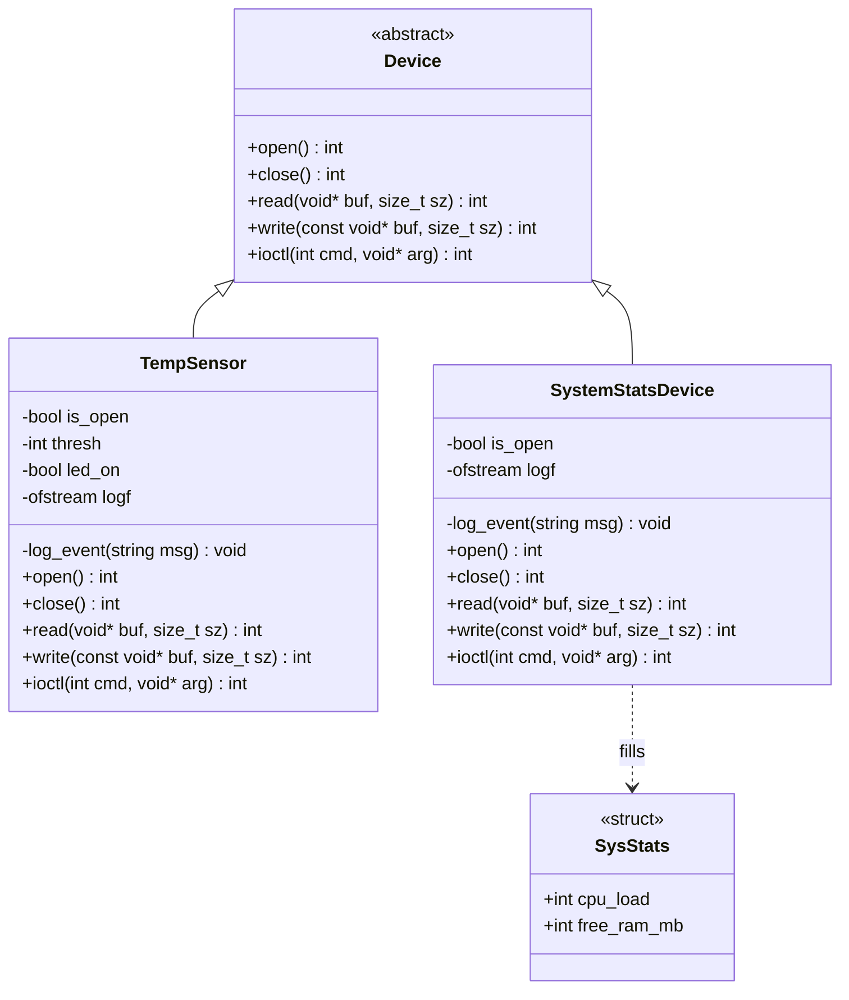
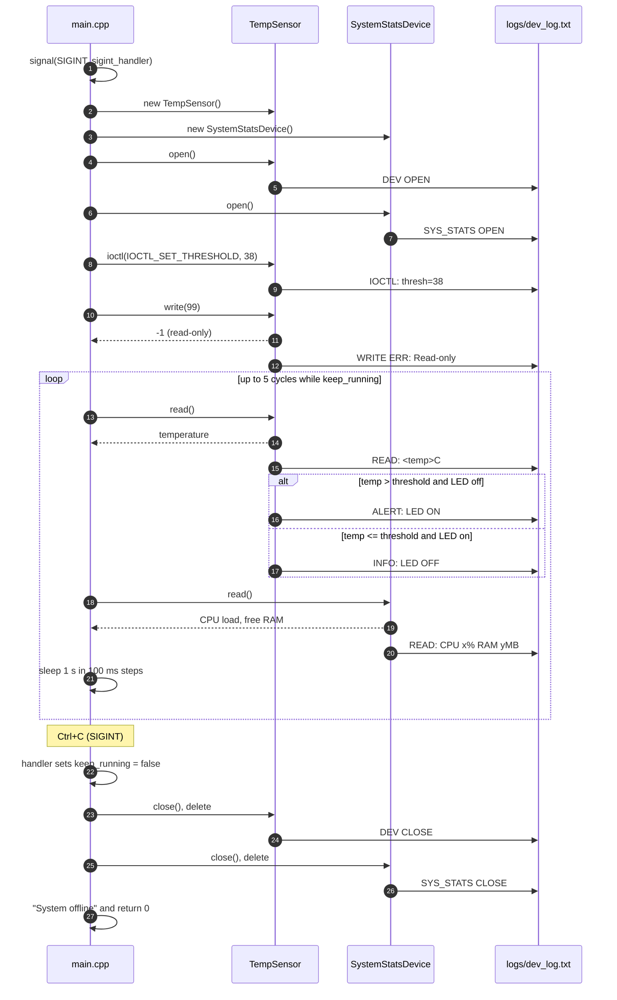

# Virtual Device Simulator

> A user-space C++ simulation of Linux character devices, built on a hardware abstraction layer that mirrors the POSIX driver interface.


-informational)


**Virtual Device Simulator** models how a Linux kernel exposes hardware through the character-device interface (`open`, `read`, `write`, `ioctl`, `close`). It allows embedded and systems software to be developed and exercised entirely in user space, with no physical hardware and no kernel module.

---

## How to Run

**Prerequisites:** a Linux environment (native or WSL), `g++` with C++11 support, and `make`.

```bash
git clone <your-repository-url>
cd <repository-folder>
mkdir -p logs
make
./sim
```

The simulator runs five polling cycles (about one second each) and then shuts down. Press `Ctrl+C` at any time to trigger a graceful shutdown. Every hardware event is appended to `logs/dev_log.txt`.

```bash
cat logs/dev_log.txt
make clean
```

> The `logs/` directory must exist before the first run, otherwise the log file cannot be opened.

---

## Table of Contents

1. [Stage 1 – Project Introduction](#stage-1--project-introduction)
2. [Stage 2 – Project Requirements Document (PRD)](#stage-2--project-requirements-document-prd)
3. [Stage 3 – System Design & Architecture](#stage-3--system-design--architecture)
4. [Stages 4 & 5 – Implementation & Testing](#stages-4--5--implementation--testing)
5. [Stage 6 – Final Presentation Details](#stage-6--final-presentation-details)

---

## Stage 1 – Project Introduction

### Objective

Design and implement a C++ program that simulates Linux character devices behind a uniform, kernel-style driver interface, demonstrating object-oriented design, POSIX-style device semantics, signal handling, and system-level logging.

### Problem Statement

Embedded and driver-level software is normally developed against physical hardware. This creates three recurring problems:

- **Hardware dependency:** development and testing stall when boards or sensors are unavailable.
- **Risk and cost:** faulty driver logic can destabilise a system or damage hardware.
- **Poor testability:** failure paths such as invalid operations, threshold breaches, and abrupt termination are difficult to reproduce on real devices.

This project provides a **virtual hardware layer** that exposes the same interface contract as a real driver, so application logic can be validated before it ever touches hardware.

### Scope

| In Scope | Out of Scope |
|---|---|
| Abstract driver interface modelled on POSIX file operations | Real Linux kernel modules (`insmod`, `/dev` nodes) |
| Two simulated devices: `TempSensor` and `SystemStatsDevice` | Interaction with real hardware or the real `/proc` filesystem |
| `ioctl`-based device configuration and virtual LED alerting | Multi-threaded or interrupt-driven I/O |
| `SIGINT` handling and graceful shutdown | Persistent configuration or network interfaces |
| Rejection of invalid operations (write to a read-only device) | |
| Timestamped, kernel-style logging to a local file | |

---

## Stage 2 – Project Requirements Document (PRD)

### Functional Requirements

| ID | Requirement |
|----|-------------|
| **FR-1** | Provide an abstract `Device` base class declaring `open`, `read`, `write`, `ioctl`, and `close`. |
| **FR-2** | `TempSensor` shall generate random temperature readings in the range **25–45 °C**. |
| **FR-3** | `TempSensor` shall accept a threshold through `ioctl` (`IOCTL_SET_THRESHOLD`, set to **38 °C** by the application) and switch a **virtual LED** on when a reading exceeds it, and off when the reading returns to normal. |
| **FR-4** | `SystemStatsDevice` shall generate simulated telemetry: **CPU load (5–98 %)** and **free RAM (1024–16384 MB)**. |
| **FR-5** | The application shall poll both devices in a loop at one-second intervals. |
| **FR-6** | The application shall intercept `SIGINT`, exit the polling loop, and call `close()` on every device before deleting it. |
| **FR-7** | Read-only devices shall reject `write()` calls, return `-1`, and log the rejection. |
| **FR-8** | Every hardware interaction shall be timestamped and appended to `logs/dev_log.txt`. |

### Non-Functional Requirements

| ID | Requirement |
|----|-------------|
| **NFR-1** | **Object-oriented design:** polymorphism through a common interface and encapsulation of device state. |
| **NFR-2** | **Zero external dependencies:** only the C++11 standard library and POSIX headers. |
| **NFR-3** | **Portability:** builds and runs on any standard Linux environment, including WSL. |
| **NFR-4** | **Resource safety:** devices are closed and freed on normal exit and on signal-driven termination. |
| **NFR-5** | **Reproducible build:** a single `make` invocation produces the `./sim` binary. |
| **NFR-6** | **Extensibility:** new devices can be added by implementing the `Device` interface without modifying existing device code. |

### Phased Development Plan

| Phase | Focus | Outcome |
|-------|-------|---------|
| **1. Foundations** | Linux environment setup, C++ fundamentals, Makefile | Working toolchain and build pipeline |
| **2. Interface Design** | Abstract `Device` class and driver contract | Stable, polymorphic driver API |
| **3. Device Implementation** | `TempSensor` and `SystemStatsDevice` | Two concrete devices with simulated data |
| **4. Hardware Behaviour** | `ioctl` threshold and virtual LED alert | Configurable, event-driven device behaviour |
| **5. System Programming** | `SIGINT` handler and graceful shutdown | Safe termination with cleanup |
| **6. Observability & Validation** | File-based logging, error-path and signal testing | Verified, auditable system behaviour |

---

## Stage 3 – System Design & Architecture

### Architecture Overview

The system follows a layered **hardware abstraction** model:

1. **Application layer (`main.cpp`):** owns the device instances, configures them, runs the polling loop, and handles signals.
2. **Driver interface layer (`Device.h`):** an abstract contract that defines how any device is accessed.
3. **Device layer (`TempSensor.h`, `SystemStatsDevice.h`):** header-only concrete "drivers" that implement the contract and simulate hardware behaviour.
4. **Logging:** each device owns a private `log_event()` routine that appends timestamped lines to `logs/dev_log.txt`, analogous to `dmesg` or `/var/log/syslog`.

The application interacts with devices only through `Device*` pointers, so it is decoupled from device-specific logic.

### UML Class Diagram



### UML Sequence Diagram



---

## Stages 4 & 5 – Implementation & Testing

### Core C++ Concepts Applied

| Concept | Application in This Project |
|---------|-----------------------------|
| **Abstraction** | `Device` exposes only the driver contract through pure virtual functions. |
| **Polymorphism** | `main.cpp` holds `Device*` pointers and calls `open`, `read`, `ioctl`, and `close`; the correct implementation is resolved at runtime through the vtable. |
| **Encapsulation** | State such as `thresh`, `led_on`, `is_open`, and the log stream is `private` and reachable only through the driver interface. |
| **Inheritance** | `TempSensor` and `SystemStatsDevice` derive publicly from `Device`, and each overrides every operation with the C++11 `override` keyword. |
| **Virtual Destructor** | `virtual ~Device() = default` guarantees correct destruction when a device is deleted through a base-class pointer. |
| **Defensive Destructors** | Each device's destructor calls `close()` only if the device is still open, so an explicit `close()` followed by `delete` never closes twice. |
| **Concurrency-Safe Flag** | `std::atomic<bool> keep_running` shares shutdown state between the signal handler and the polling loop. |
| **Standard Library** | `<random>`, `<chrono>`, `<fstream>`, `<thread>`, and `<csignal>` cover data generation, timestamps, logging, sleeping, and signal handling. |

### Module Integration

- `main.cpp` creates each concrete device, stores it as a `Device*`, and drives both through the same interface.
- The `ioctl` channel is used for **configuration**: the application sets the threshold with `IOCTL_SET_THRESHOLD` without touching sensor internals. Unknown commands, a null argument, or a closed device return `-1`.
- `read()` validates that the device is open and that the buffer size matches the expected type, returning `-1` otherwise.
- Until a threshold is set, `TempSensor` uses a default of 100, so no alert can fire. The LED logic is edge-triggered: it logs only when the state changes, not on every reading.
- `SystemStatsDevice` returns its data through the `SysStats` struct and rejects `ioctl` as unsupported.
- Both devices append to the same `logs/dev_log.txt`, producing one auditable record per run.

### Sample Console Output

```text
Initializing system devices (Press Ctrl+C to exit)...

>>> DEMO: Testing Error Path (Writing to Read-Only TempSensor)...
>>> RESULT: Write blocked by driver. Check logs for details.
------------------------
[HW] LED ON - Hot!
Temp Sensor: 45C
System Load: 83% CPU | 6272 MB Free RAM
------------------------
```

> Readings are randomised on every run.

### Sample Log Output (from a real run)

```text
[Wed Sep 30 14:22:16 2026] DEV OPEN
[Wed Sep 30 14:22:16 2026] IOCTL: thresh=38
[Wed Sep 30 14:22:16 2026] READ: 34C
[Wed Sep 30 14:22:17 2026] READ: 45C
[Wed Sep 30 14:22:17 2026] ALERT: LED ON
[Wed Sep 30 14:22:18 2026] READ: 36C
[Wed Sep 30 14:22:18 2026] INFO: LED OFF
[Wed Sep 30 14:22:21 2026] DEV CLOSE
```

### Testing Strategy

Testing is performed as targeted, repeatable scenarios against the running simulator, verified through console output and `logs/dev_log.txt`.

| Test | Scenario | Expected Result | Evidence |
|------|----------|-----------------|----------|
| **T1 – Normal Operation** | Run `./sim` to completion. | Five polling cycles; temperature within 25–45 °C, CPU load within 5–98 %, every read logged. | `READ:` entries in the log |
| **T2 – Threshold Alert** | Threshold set to 38 °C; poll until a reading exceeds it. | LED switches on with an `ALERT: LED ON` entry, and off again with `INFO: LED OFF` when the reading drops. | Console `[HW]` lines and log entries |
| **T3 – Error Path (Read-Only Write)** | `main.cpp` calls `write()` on the read-only `TempSensor`. | Driver returns `-1`, the application prints the blocked message, and the driver logs `WRITE ERR: Read-only`. | Console `>>> RESULT` line and log entry |
| **T4 – Graceful Shutdown** | Press `Ctrl+C` during polling. | Handler prints the interrupt message, the loop exits, both devices are closed and deleted, and `System offline` is printed. | Console output and `DEV CLOSE` / `SYS_STATS CLOSE` entries |

#### Error Path Test (T3)

The simulator deliberately performs a `write()` against the read-only sensor at start-up to verify the driver boundary. A correct driver must refuse the call rather than silently accept it, mirroring how a kernel driver reports an unsupported operation. The driver returns `-1`, and the application confirms the rejection on the console.

#### SIGINT Graceful Shutdown Test (T4)

`Ctrl+C` normally terminates a process immediately and skips all cleanup. The custom handler instead sets `keep_running` to `false`. The main loop sleeps in 100 ms steps, so it notices the flag within a tenth of a second, exits, and runs the shutdown sequence: `close()` followed by `delete` on each device.

---

## Stage 6 – Final Presentation Details

### Project Achievements

- Implemented a clean **hardware abstraction layer** that mirrors the POSIX character-device model.
- Demonstrated **runtime polymorphism** with two independent devices behind one interface.
- Built **`ioctl`-driven configuration** with an edge-triggered virtual LED alert.
- Implemented **signal-driven graceful shutdown** with deterministic cleanup on `SIGINT`.
- Validated **negative-path behaviour**: invalid operations, wrong buffer sizes, and closed devices are all rejected.
- Produced **kernel-style, timestamped logs** for traceability of hardware activity.
- Delivered the system with **zero external dependencies** and a single-command build.

### Limitations

- **User-space only:** this is a simulation, not a loadable kernel module, so it does not use `/dev` nodes, `insmod`, or kernel APIs.
- **Simulated data:** readings are pseudo-random rather than sourced from real sensors or `/proc`.
- **Single-threaded and bounded:** devices are polled sequentially, and the demo loop is limited to five cycles.
- **Separate log streams:** each device owns its own file stream, so entries from different devices are buffered independently and can appear out of chronological order within the log.
- **Signal handler scope:** the handler prints to `std::cout` for user feedback. Strictly, only async-signal-safe calls are guaranteed in a handler, so a hardened version would only set the atomic flag and print from the main loop.
- **Basic logging:** the log is a plain text file with no rotation, severity levels, or size limits, and the `logs/` directory must be created beforehand.

### Future Improvements

- **Shared logger:** a single logger class that all devices use, giving strictly ordered entries and log levels.
- **Multi-threading:** dedicated polling threads per device, with synchronised logging.
- **Buzzer device:** a write-capable actuator that complements the LED alert.
- **Device manager:** a registry for dynamic device registration, lookup, and lifecycle control.
- **Real data sources:** read live metrics from `/proc/stat` and `/proc/meminfo` for `SystemStatsDevice`.
- **Kernel port:** migrate the driver logic to a real Linux kernel module exposed through `/dev`.
- **Automated tests:** a unit-test harness and CI pipeline for regression testing.

---

## Project Structure

```text
.
├── Makefile
├── README.md
├── main.cpp
├── Device.h
├── TempSensor.h
├── SystemStatsDevice.h
└── logs/
    └── dev_log.txt
```

---

## Author

**Rachit**
B.Tech, Computer Science & Engineering (Data Science)
ITER, Siksha 'O' Anusandhan University, Bhubaneswar
LinkedIn: [linkedin.com/in/rachit-patnaik-87933a332](https://linkedin.com/in/rachit-patnaik-87933a332)

*Capstone project for the 20-day training program covering Linux, C++, System Programming, and Computer Architecture.*
