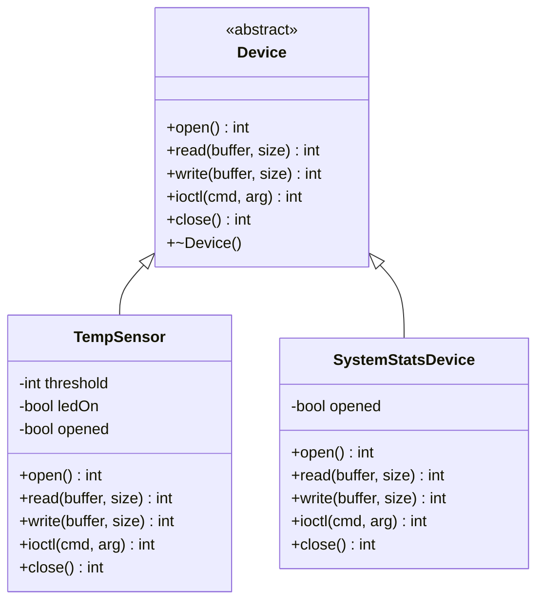
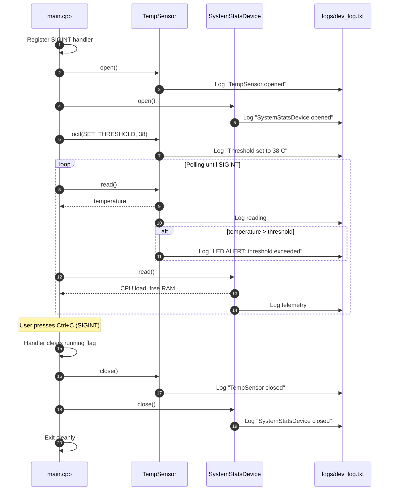

# Virtual Device Simulator

> A user-space C++ simulation of Linux character devices, built on a hardware abstraction layer that mirrors the POSIX driver interface.


-informational)


**Virtual Device Simulator** models how a Linux kernel exposes hardware through the character-device interface (`open`, `read`, `write`, `ioctl`, `close`). It lets embedded and systems software be developed, exercised, and tested entirely in user space, with no physical hardware and no kernel module required.

---

## How to Run

**Prerequisites:** a Linux environment (native or WSL), `g++` with C++11 support, and `make`.

```bash
git clone <your-repository-url>
cd <repository-folder>
make
./sim
```

Press `Ctrl+C` at any time to trigger a graceful shutdown. All hardware events are written to `logs/dev_log.txt`.

```bash
cat logs/dev_log.txt
make clean
```

---

## Table of Contents

1. [Stage 1 – Project Introduction](#stage-1--project-introduction)
2. [Stage 2 – Project Requirements Document (PRD)](#stage-2--project-requirements-document-prd)
3. [Stage 3 – System Design & Architecture](#stage-3--system-design--architecture)
4. [Stages 4 & 5 – Implementation & Testing](#stages-4--5--implementation--testing)
5. [Stage 6 – Final Presentation Details](#stage-6--final-presentation-details)

---

## Stage 1 – Project Introduction

### Objective

Design and implement a C++ program that simulates Linux character devices behind a uniform, kernel-style driver interface, demonstrating object-oriented design, POSIX-style device semantics, signal handling, and system-level logging.

### Problem Statement

Embedded and driver-level software is normally developed against physical hardware. This creates three recurring problems:

- **Hardware dependency:** development and testing stall when boards or sensors are unavailable.
- **Risk and cost:** faulty driver logic can destabilise a system or damage hardware.
- **Poor testability:** failure paths such as invalid operations, threshold breaches, and abrupt termination are difficult to reproduce on real devices.

This project addresses these problems by providing a **virtual hardware layer** that behaves like real devices through the same interface contract, so application logic can be validated before it ever touches hardware.

### Scope

| In Scope | Out of Scope |
|---|---|
| Abstract driver interface modelled on POSIX file operations | Real Linux kernel modules (`insmod`, `/dev` nodes) |
| Two simulated devices: `TempSensor` and `SystemStatsDevice` | Interaction with real hardware or the real `/proc` filesystem |
| `ioctl`-based device configuration and virtual LED alerting | Multi-threaded or interrupt-driven I/O |
| `SIGINT` handling and graceful shutdown | Persistent configuration or network interfaces |
| Rejection of invalid operations (write to a read-only device) | |
| Timestamped, kernel-style logging to a local file | |

---

## Stage 2 – Project Requirements Document (PRD)

### Functional Requirements

| ID | Requirement |
|----|-------------|
| **FR-1** | Provide an abstract `Device` base class declaring `open`, `read`, `write`, `ioctl`, and `close`. |
| **FR-2** | `TempSensor` shall generate random temperature readings in the range **25–45 °C**. |
| **FR-3** | `TempSensor` shall accept a threshold (e.g., **38 °C**) through `ioctl` and trigger a **virtual LED alert** when a reading exceeds it. |
| **FR-4** | `SystemStatsDevice` shall generate simulated telemetry: **CPU load (5–98 %)** and **free RAM**. |
| **FR-5** | The application shall poll all devices in a continuous loop. |
| **FR-6** | The application shall intercept `SIGINT`, exit the polling loop, and call `close()` on every device. |
| **FR-7** | Read-only devices shall reject `write()` calls and report an error. |
| **FR-8** | Every hardware interaction shall be timestamped and appended to `logs/dev_log.txt`. |

### Non-Functional Requirements

| ID | Requirement |
|----|-------------|
| **NFR-1** | **Object-oriented design:** polymorphism through a common interface and encapsulation of device state. |
| **NFR-2** | **Zero external dependencies:** only the C++11 standard library and POSIX headers. |
| **NFR-3** | **Portability:** builds and runs on any standard Linux environment, including WSL. |
| **NFR-4** | **Resource safety:** no leaked resources on normal exit or on signal-driven termination. |
| **NFR-5** | **Reproducible build:** a single `make` invocation produces the `./sim` binary. |
| **NFR-6** | **Extensibility:** new devices can be added by implementing the `Device` interface without modifying existing device code. |

### Phased Development Plan

| Phase | Focus | Outcome |
|-------|-------|---------|
| **1. Foundations** | Linux environment setup, C++ fundamentals, Makefile | Working toolchain and build pipeline |
| **2. Interface Design** | Abstract `Device` class and driver contract | Stable, polymorphic driver API |
| **3. Device Implementation** | `TempSensor` and `SystemStatsDevice` | Two concrete devices with simulated data |
| **4. Hardware Behaviour** | `ioctl` threshold and virtual LED alert | Configurable, event-driven device behaviour |
| **5. System Programming** | `SIGINT` handler and graceful shutdown | Safe termination with cleanup |
| **6. Observability & Validation** | File-based logging, error-path and signal testing | Verified, auditable system behaviour |

---

## Stage 3 – System Design & Architecture

### Architecture Overview

The system follows a layered **hardware abstraction** model:

1. **Application layer (`main.cpp`):** owns the device instances, configures them, runs the polling loop, and handles signals.
2. **Driver interface layer (`Device`):** an abstract contract that defines how any device is accessed.
3. **Device layer (`TempSensor`, `SystemStatsDevice`):** concrete "drivers" that implement the contract and simulate hardware behaviour.
4. **Logging layer:** a timestamped file logger that records every hardware interaction, analogous to `dmesg` or `/var/log/syslog`.

The application interacts with devices only through `Device` pointers, so it is fully decoupled from device-specific logic.

### UML Class Diagram



### UML Sequence Diagram



---

## Stages 4 & 5 – Implementation & Testing

### Core C++ Concepts Applied

| Concept | Application in This Project |
|---------|-----------------------------|
| **Abstraction** | `Device` exposes only the driver contract through pure virtual functions. |
| **Polymorphism** | The application calls `open`, `read`, `ioctl`, and `close` through `Device*`, and the correct device implementation is resolved at runtime via the vtable. |
| **Encapsulation** | Device state such as the threshold, LED status, and open flag is `private` and reachable only through the driver interface. |
| **Inheritance** | `TempSensor` and `SystemStatsDevice` derive publicly from `Device`. |
| **Virtual Destructor** | Guarantees correct cleanup when devices are destroyed through a base-class pointer. |
| **Standard Library** | `<random>`, `<chrono>`, `<fstream>`, and `<csignal>` are used for data generation, timestamps, logging, and signal handling. |

### Module Integration

- `main.cpp` instantiates each concrete device and stores it as a `Device*`, then drives all of them through the same interface.
- The `ioctl` channel is used for **configuration**: the application sets the temperature threshold at start-up without knowing anything about the sensor's internals.
- The logger is invoked by each device on every hardware event, producing a single chronological record across all modules.
- A flag of type `volatile sig_atomic_t` is shared between the signal handler and the polling loop, which keeps the handler async-signal-safe.

### Sample Log Output

```text
[2026-09-30 10:15:02] [INFO ] TempSensor: device opened
[2026-09-30 10:15:02] [INFO ] SystemStatsDevice: device opened
[2026-09-30 10:15:02] [IOCTL] TempSensor: threshold set to 38 C
[2026-09-30 10:15:03] [READ ] TempSensor: 36 C
[2026-09-30 10:15:03] [READ ] SystemStatsDevice: CPU 42%, free RAM 3120 MB
[2026-09-30 10:15:04] [ALERT] TempSensor: 41 C exceeds threshold, LED ON
[2026-09-30 10:15:09] [INFO ] SIGINT received, shutting down
[2026-09-30 10:15:09] [INFO ] TempSensor: device closed
[2026-09-30 10:15:09] [INFO ] SystemStatsDevice: device closed
```

> The values above are illustrative. Actual readings are randomised on every run.

### Testing Strategy

Testing is performed as targeted, repeatable scenarios against the running simulator, with results verified through both console output and `logs/dev_log.txt`.

| Test | Scenario | Expected Result | Status |
|------|----------|-----------------|--------|
| **T1 – Normal Operation** | Run `./sim` and let the loop poll both devices. | Temperatures remain within 25–45 °C, CPU load within 5–98 %, and every read is logged. | Pass |
| **T2 – Threshold Alert** | Set the threshold to 38 °C and poll until a reading exceeds it. | The virtual LED alert triggers and an `ALERT` entry is written. | Pass |
| **T3 – Error Path (Read-Only Write)** | Call `write()` on the read-only sensor. | The driver rejects the operation, returns an error code, and logs the rejection. | Pass |
| **T4 – Graceful Shutdown** | Press `Ctrl+C` during polling. | The handler exits the loop, `close()` runs on every device, and closing entries appear in the log. | Pass |

#### Error Path Test (T3)

The simulator deliberately performs a `write()` against the read-only sensor to verify the driver boundary. A correct driver must refuse the call rather than silently accept it, mirroring how a kernel returns an error such as `EPERM` or `EBADF` for an unsupported operation.

#### SIGINT Graceful Shutdown Test (T4)

`Ctrl+C` normally terminates a process immediately and skips all cleanup. The custom handler intercepts the signal, sets a flag, and lets the main loop finish its iteration. The application then closes each device in order and exits normally, which confirms that no device is left open and no resources are leaked.

---

## Stage 6 – Final Presentation Details

### Project Achievements

- Implemented a clean **hardware abstraction layer** that mirrors the POSIX character-device model.
- Demonstrated **runtime polymorphism** with two independent devices behind one interface.
- Built **`ioctl`-driven configuration** with an event-based virtual LED alert.
- Implemented **safe signal handling** with deterministic cleanup on `SIGINT`.
- Validated **negative-path behaviour**, proving the driver rejects invalid operations.
- Produced **kernel-style, timestamped logs** for full traceability of hardware activity.
- Delivered the entire system with **zero external dependencies** and a single-command build.

### Limitations

- **User-space only:** this is a simulation, not a loadable kernel module, so it does not use `/dev` nodes, `insmod`, or kernel APIs.
- **Simulated data:** readings are pseudo-random rather than sourced from real sensors or `/proc`.
- **Single-threaded:** devices are polled sequentially in one loop, with no interrupt or asynchronous model.
- **Basic logging:** the log is a plain text file with no rotation, severity filtering, or size limits.

### Future Improvements

- **Multi-threading:** dedicated polling threads per device, with synchronised logging.
- **Buzzer device:** an actuator that complements the LED alert and demonstrates write-capable devices.
- **Device manager:** a registry for dynamic device registration, lookup, and lifecycle control.
- **Real data sources:** read live metrics from `/proc/stat` and `/proc/meminfo` for `SystemStatsDevice`.
- **Kernel port:** migrate the driver logic to a real Linux kernel module exposed through `/dev`.
- **Automated tests:** a unit-test harness and CI pipeline for regression testing.
- **Configurable logging:** log levels, rotation, and an optional `syslog` backend.

---

## Project Structure

```text
.
├── Makefile
├── README.md
├── main.cpp
├── Device.h
├── TempSensor.h
├── SystemStatsDevice.h
└── logs/
    └── dev_log.txt
```

> Adjust the file names above to match your repository layout.

---

## Author

**Rachit**
B.Tech, Computer Science & Engineering (Data Science)
ITER, Siksha 'O' Anusandhan University, Bhubaneswar
LinkedIn: [linkedin.com/in/rachit-patnaik-87933a332](https://linkedin.com/in/rachit-patnaik-87933a332)
